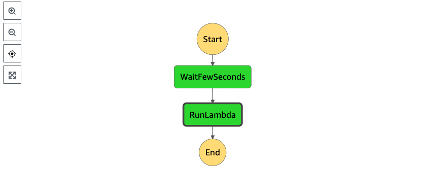

# sfn-golang-serverless-example
This is basic example of how to use [Serverless Framework](https://www.serverless.com/) deploy [AWS step functions](https://aws.amazon.com/step-functions/) and [AWS Lambda](https://aws.amazon.com/lambda/) written in [Go/Golang](https://golang.org).

# Overview

 - Wait few seconds
 - Then uses Lambda to process something
 - Run Golang code to execute step function
 
# Install Serverless Framework and relative plugins

    npm install -g serverless@2.72.3
    npm install -g serverless-hooks-plugin
    npm install -g serverless-step-functions
# Deployment
Run Serverless deploy:

    sls deploy
After deploy completely, open [AWS Console](console.aws.amazon.com/) and check result
\
Then copy Step functions ARN.\
Open file main.go and replace `stateMachineArn` variable value with your Step functions ARN.\
Run execution:

    go run main.go
After that, open AWS Console then go to your step functions to check history execution.
# License

This example is released under the Apache License, Version 2.0.

